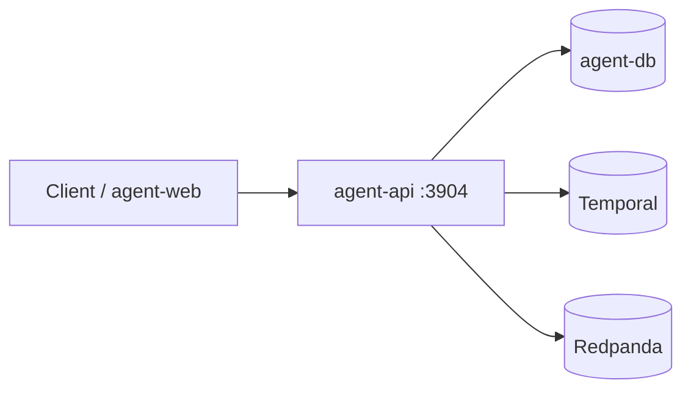
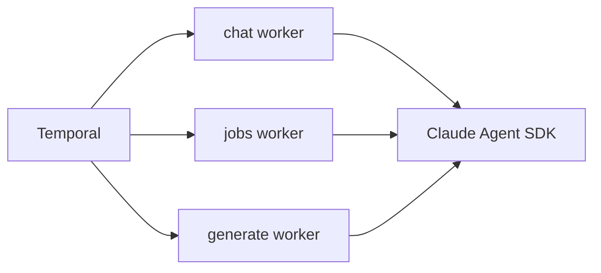
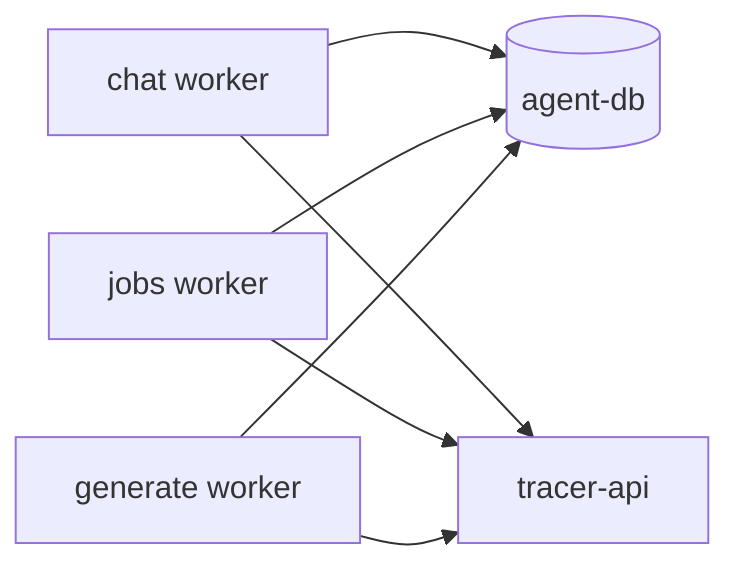

# tracer-agent-ts

에이전트 서비스의 TypeScript 구현이며 계약의 정본입니다. NestJS API가 대화와 잡의 접수와 조회와 취소와 스트림을 제공하고, Temporal 워커가 chat·jobs·generate 큐를 각각 소비해 Claude Agent SDK를 실행합니다. 실행 원장은 이 서비스가 소유하며, 실행에 필요한 기록은 추적 API를 HTTP로 읽고 산출물도 같은 경로로 되돌려 보냅니다.

같은 계약을 만족하는 Python 구현이 따로 있고 배포에서 어느 이미지를 올리느냐로 둘 중 하나가 선택됩니다. 두 구현체 사이에 지금 남아 있는 차이는 계약 저장소의 `conformance/cases/divergence.json`이 갖습니다.

## 기능

- Claude Agent SDK 기반 대화 실행과 취소·재생·도구 확인
- Temporal 기반 대화·잡 워크플로와 큐 분리
- chat, recipe scan, task cleanup, title suggestion 에이전트
- 실행 단계·토큰 사용량·비용·모델 호출의 관측 정보 기록
- 추적 API를 사용하는 도구와 산출물 연동
- 자격 증명이 답과 초안과 도구 결과로 새지 않도록 가리는 절차
- OpenTelemetry와 선택적 LangSmith 연동

## 아키텍처



### 워커와 모델 실행



### 원장과 추적 연동



| 구성 요소 | 책임과 경계 |
| --- | --- |
| `agent-api` | HTTP 접수·조회·취소·스트림과 `/internal/surface`를 제공합니다 |
| chat 워커 | 대화 스레드와 실행을 처리합니다 |
| jobs 워커 | 짧은 잡 액티비티와 상태 정산을 처리합니다 |
| generate 워커 | 모델을 호출하는 긴 액티비티를 분리해 처리합니다 |
| `agent-db` | 이 서비스가 소유하는 실행 원장입니다 |
| `libs/tracer-client` | 추적 API 호출과 Kafka 토픽 기반 실행 갱신 전달을 담당합니다 |

추적 데이터베이스와 OpenSearch를 직접 읽지 않습니다. API와 워커는 계약의 `x-monitor-user` 사용자 식별 헤더와 응답 봉투 규칙을 따릅니다.

## 요구 사항

- Node.js `>=24.0.0 <25.0.0` (`.nvmrc`)와 npm
- PostgreSQL 17 계열의 agent database
- Kafka 호환 브로커 또는 Redpanda
- Temporal Server
- 실행 중인 `tracer-api` 또는 게이트웨이
- `contract` submodule
- `prd` 프로파일에서는 설정 API에 저장된 모델 자격 증명

## 설치와 실행

```bash
git clone --recurse-submodules https://github.com/agent-tracer/tracer-agent-ts.git
cd tracer-agent-ts
npm ci

# 이미 clone 한 경우
git submodule update --init --recursive

# agent-db 스키마 적용 — 계약의 DDL 을 Flyway 가 적용하며 도커를 요구한다
npm run schema:apply

# API 와 세 워커를 각각 실행
npm run start --workspace=@tracer-agent/agent-api
npm run start:chat --workspace=@tracer-agent/agent-worker
npm run start:jobs --workspace=@tracer-agent/agent-worker
npm run start:generate --workspace=@tracer-agent/agent-worker
```

API와 각 워커는 별도의 프로세스로 실행합니다. 설정은 `application.yaml` → `application.local.yaml` → 환경변수 순서로 병합됩니다. Compose 배포에서는 `agent-tracer-stack`이 이 프로세스들과 의존 인프라를 함께 실행합니다.

### 모델 자격 증명

`MONITOR_PROFILE=local`로 API와 세 워커를 모두 실행하면 사용자별 Anthropic API key 없이 사용자의 로컬 Claude CLI 인증으로 Claude Agent SDK를 실행합니다. API는 Claude를 실행하지 않으므로 프로파일만 필요하고, 사용자 설정과 CLI 인증에 필요한 `HOME`과 `CLAUDE_CODE_OAUTH_TOKEN`은 워커의 하위 Claude 프로세스에만 전달됩니다.

```bash
MONITOR_PROFILE=local npm run start --workspace=@tracer-agent/agent-api
MONITOR_PROFILE=local npm run start:chat --workspace=@tracer-agent/agent-worker
MONITOR_PROFILE=local npm run start:jobs --workspace=@tracer-agent/agent-worker
MONITOR_PROFILE=local npm run start:generate --workspace=@tracer-agent/agent-worker
```

`prd` 프로파일은 설정 API의 암호화된 Anthropic API key를 사용하며 `MONITOR_SETTINGS_ENCRYPTION_KEY`를 운영 값으로 지정해야 합니다. 이 로컬 CLI 인증 경로는 TypeScript 구현에만 해당하며 Python 구현은 API key 경로를 사용합니다.

## 환경변수

| 변수 | 기본값 | 용도 |
| --- | --- | --- |
| `MONITOR_PROFILE` | `local` | 실행 프로파일 |
| `MONITOR_LISTEN_HOST` | `127.0.0.1` | API bind host |
| `AGENT_API_PORT` | `3904` | API 포트 |
| `AGENT_DB_HOST` | `127.0.0.1` | agent-db host |
| `AGENT_DB_PORT` | `5434` | agent-db 포트 |
| `AGENT_DB_NAME` | `agent` | 데이터베이스 |
| `AGENT_DB_USER`, `AGENT_DB_PASSWORD` | `monitor` | 데이터베이스 자격 증명 |
| `KAFKA_BROKERS` | `localhost:19092` | 쉼표로 구분한 브로커 목록 |
| `TEMPORAL_ADDRESS` | `localhost:7233` | Temporal 주소 |
| `TEMPORAL_NAMESPACE` | `default` | Temporal 네임스페이스 |
| `TRACER_API_URL` | `http://127.0.0.1:3902` | 추적 API |
| `AGENT_API_URL` | API 포트 기반 | 자기 API base URL |
| `AGENT_TASK_QUEUE_PREFIX` | `agent` | 큐 접두사 |
| `MONITOR_SETTINGS_ENCRYPTION_KEY` | 로컬 대체값 | 저장 설정 암호화 |
| `MONITOR_AUTH_MODE`, `MONITOR_AUTH_TOKEN_SECRET` | 비활성 | 선택적 토큰 인증 |

## 검증

```bash
npm run check:paths
npm run lint
npm test
npm run build
node contract/conformance/runner/verify.mjs
```

`agent-api`와 `agent-worker`의 실행 상태 케이스는 계약이 소유한 migration을 적용한 Postgres를
컨테이너로 띄워 판정을 대조합니다. `npm test`는 도커를 요구하며, 도커가 없으면 그 두 배포 단위의
테스트가 컨테이너 기동에서 멈춥니다.

실행 중인 API 표면까지 비교하려면 주소를 전달합니다.

```bash
node contract/conformance/runner/verify.mjs http://127.0.0.1:3904
```

CI는 lint, test, build, 계약 적합성, 이미지 빌드를 수행합니다.

## 저장소 구조

```text
tracer-agent-ts/
├── contract/                    tracer-agent-contract submodule
├── libs/
│   ├── platform/                설정·DB·Kafka·로깅·원시 타입
│   ├── llm/                     Claude 실행기·가격·관측·오류
│   └── tracer-client/           추적 API 클라이언트와 API 창
├── services/
│   ├── agent-api/               HTTP 표면과 대화·잡·설정·헬스 슬라이스
│   └── agent-worker/            Temporal 진입점과 대화·레시피·정리·제목 슬라이스
├── scripts/                     경로·린트·의존·커밋 검사
├── architecture.manifest.mjs    계층·단위·봉인·예산 규칙의 정본
├── llm.yaml                     모델 가격과 카탈로그 입력
└── Dockerfile
```

## 개발 컨벤션

배포 단위는 `libs/platform`, `libs/llm`, `libs/tracer-client`, `services/agent-api`, `services/agent-worker`입니다. 서비스 도메인의 의존 방향은 `inbound → application → port → adapter → model`이며, inbound는 application과 model만, application은 port와 model만, adapter는 port와 model만 부릅니다. 시간·난수·환경·스케줄러는 application 계층에서 직접 쓰지 않고 port 뒤에 둡니다.

파일의 역할은 `.controller.ts`, `.usecase.ts`, `.port.ts`, `.adapter.ts`, `.workflow.ts`, `.activity.ts` 접미사로 드러냅니다. TypeORM·NestJS·Temporal SDK·zod는 manifest가 정한 경계에서만 씁니다. workspace import는 `@tracer-agent/*`와 생성된 `~unit/*` alias를 사용하고 깊은 상대 경로를 피합니다. 파일당 300줄, 테스트 없는 유스케이스, 직접 ID 생성은 자동 검사가 막습니다.

규칙의 정본은 `architecture.manifest.mjs`와 이를 읽는 검사기입니다. 생성되는 path alias 파일은 `npm run check:paths`로 신선도를 확인합니다. 계약·DB 스키마·큐를 바꾸면 `contract` submodule과 적합성 케이스를 먼저 갱신합니다.

## 에이전트 구현 문서

노드의 실행 단계와 토폴로지, 노드 간 이동, 도구, 프롬프트, SDK 실행 경계, 워크플로 시각화는 [TypeScript 에이전트 실행 구조 문서](services/agent-worker/src/domain/README.md)에서 확인한다. 에이전트별 상세 내용은 [Chat](services/agent-worker/src/domain/chat/README.md), [Recipe](services/agent-worker/src/domain/recipe/README.md), [Cleanup](services/agent-worker/src/domain/cleanup/README.md), [Title](services/agent-worker/src/domain/title/README.md) 문서에 정리한다.

## 관련 저장소

- [tracer-agent-contract](https://github.com/agent-tracer/tracer-agent-contract) — HTTP·wire·workflow·DB·prompt 계약
- [tracer-agent-python](https://github.com/agent-tracer/tracer-agent-python) — 같은 계약의 Python 구현
- [tracer-agent-web](https://github.com/agent-tracer/tracer-agent-web) — 에이전트 화면 리모트
- [agent-tracer](https://github.com/agent-tracer/agent-tracer) — 추적 수집·조회 플랫폼
- [agent-tracer-stack](https://github.com/agent-tracer/agent-tracer-stack) — 구현체 선택과 배포 합성

## 라이선스

MIT License
