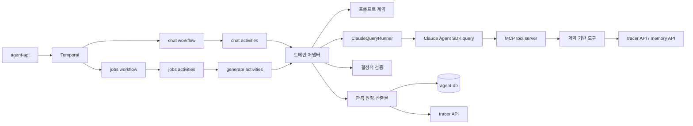
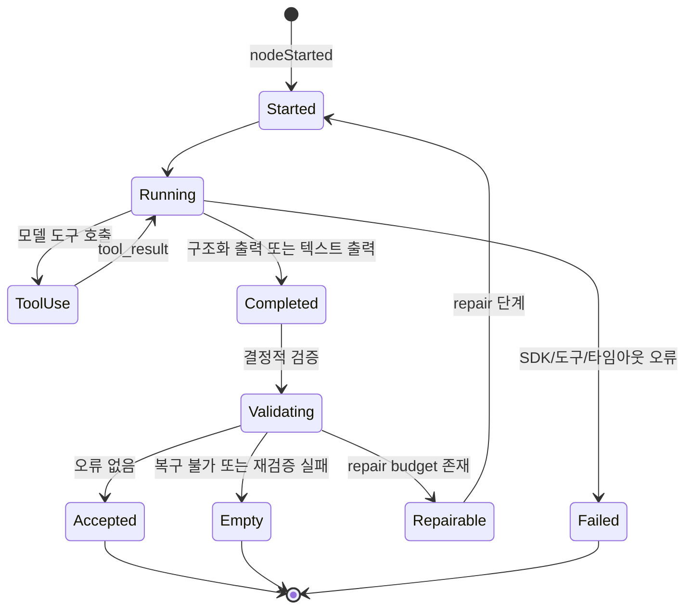
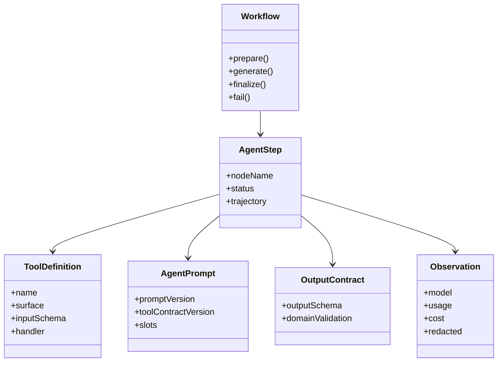
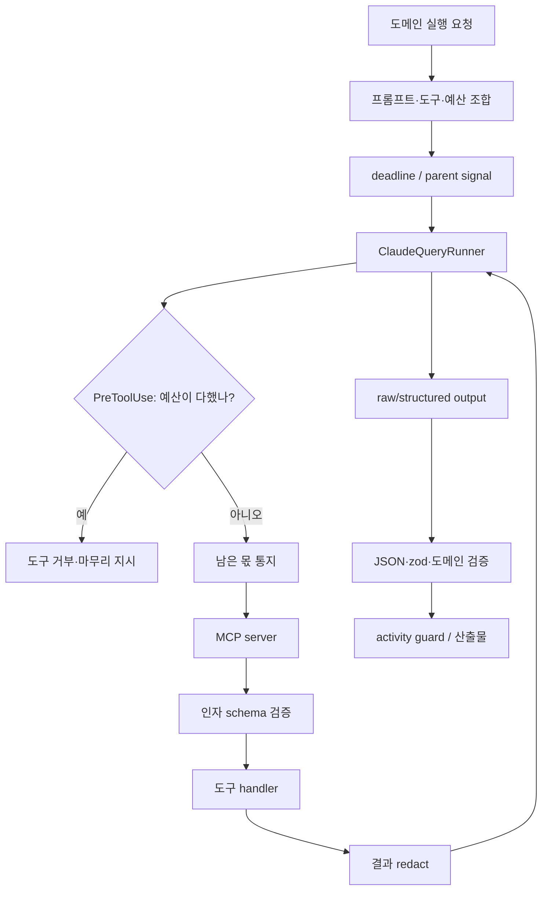
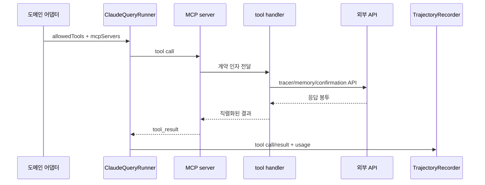
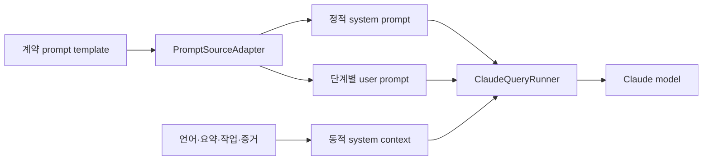
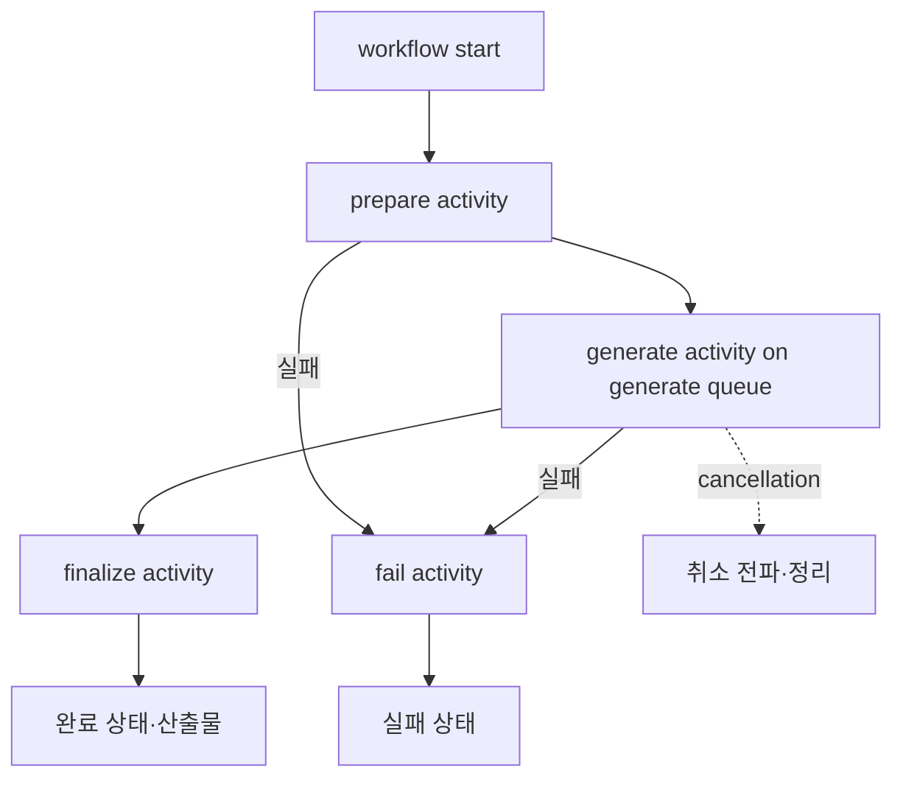

# TypeScript 에이전트 실행 구조

이 문서는 `services/agent-worker/src/domain`에 구현된 TypeScript 에이전트의 실행 구조를 정리한다. 설명의 기준은 실제 코드와 계약 저장소이며, 노드·미들웨어·도구·프롬프트·워크플로 사이의 경계를 한 문서에서 확인할 수 있도록 구성한다.

현재 이 디렉터리에서 Claude Agent SDK를 호출하는 도메인 에이전트는 Chat·Recipe·Cleanup·Title이다. 계약의 잡 종류는 `title.suggestion`·`recipe.scan`·`task.cleanup` 셋이다. 이 저장소의 `support/job.const.ts`가 그 밖에 `rule.generation`을 더 들고 있으나 계약에도 워크플로 등록에도 그 자리가 없다.

## 먼저 확인할 결론

TypeScript 구현은 LangGraph와 같은 그래프 실행기를 사용하지 않는다. Temporal 워크플로가 실행 순서를 보장하고, 도메인 어댑터가 단계별 SDK 호출과 분기와 검증을 직접 조정한다. 따라서 이 문서에서 말하는 “노드”는 그래프 라이브러리의 객체가 아니라 `survey`, `probe`, `investigate`, `repair`, `triage`, `inspect`, `decide`와 같은 실행 단계와 그 단계가 기록하는 `nodeName`을 의미한다.

모델 호출의 중심은 `libs/llm/src/runner/claude/claude.query.runner.ts`의 `ClaudeQueryRunner`이다. 도메인 어댑터는 프롬프트와 도구 계약과 출력 스키마를 조합해 실행기를 호출하고, 실행기는 Claude Agent SDK의 `query()`와 MCP 서버와 SDK hook을 연결한다.

## 전체 토폴로지

배포 프로세스는 `chat`, `jobs`, `generate` 큐를 분리한다. `jobs` 워커는 준비·정산·실패 처리를 담당하고, 모델 호출처럼 오래 걸리는 액티비티는 `generate` 큐로 라우팅된다. Chat은 대화 실행의 준비와 생성을 별도 액티비티로 두며, 스레드 단위 점유 상태를 확인한 뒤 실행한다.

## 에이전트별 문서

- [Chat 에이전트](chat/README.md): 대화·메모리·도구 확인·스트림·스레드 실행
- [Recipe 에이전트](recipe/README.md): survey·probe·investigate·redispatch·repair·provenance
- [Cleanup 에이전트](cleanup/README.md): triage·inspect·decide·redispatch·repair
- [Title 에이전트](title/README.md): task event 조사·제목 제안·repair

## 노드와 단계

각 단계는 하나의 SDK 호출 또는 하나의 결정적 처리 단위로 기록된다. 단계가 모델 호출이면 `ClaudeQueryRunner`가 스트림과 도구 호출과 출력 검증을 수집하고, 도메인 어댑터가 `nodeStarted`, `nodeCompleted`, `nodeFailed`, `routeSelected`, `validationFailed`와 같은 실행 이벤트를 남긴다.

## 타입 체계

| 타입 범주 | TypeScript 표현 | 의미 |
| --- | --- | --- |
| 워크플로 타입 | Temporal workflow/activity input과 stage model | 장기 실행 순서와 액티비티 경계를 표현한다 |
| 실행 단계 타입 | 단계 이름, trajectory step, node trace event | 모델 호출·병렬 조사·결정적 검증을 실행 원장에 기록한다 |
| 도구 타입 | 계약 tool definition, zod argument shape, handler | 도구 이름·surface·인자·외부 API 호출을 함께 정의한다 |
| 프롬프트 타입 | 계약 `AgentPrompt`, `promptVersion`, slot map | 정적 system prompt와 동적 실행 context를 결합한다 |
| 출력 타입 | zod output schema, domain output model | JSON 구조와 도메인 규칙을 순서대로 검증한다 |
| 관측 타입 | `AgentRunObservation`, `TrajectoryRecorder` | 모델·turn·token·cost·도구·검증 결과를 정제해 보관한다 |
| 실패 타입 | `AgentExecutionFailure`, Temporal `ApplicationFailure` | 모델 실행 오류와 재시도 가능성을 계층별로 전달한다 |

## 노드 간 이동

1. Temporal이 워크플로의 액티비티 순서를 호출한다.
2. 준비 단계가 입력과 후보와 실행 원장을 구성한다.
3. 어댑터가 단계별 예산을 예약하고 SDK 호출을 실행한다.
4. 도구 호출은 MCP 서버를 통해 계약에 정의된 외부 API로 전달된다.
5. 출력은 zod 기반 구조 검증과 도메인 규칙 검증을 통과해야 산출물로 승격된다.
6. `redispatch`가 있으면 남은 예산과 재분배 횟수를 확인한 뒤 조사 단계로 되돌아간다.
7. 검증 오류가 있고 repair 예산이 남아 있으면 `repair`를 한정 횟수로 실행한다.
8. 복구 후에도 오류가 남으면 안전한 빈 결과 또는 실패 상태로 종료한다.

## 미들웨어에 해당하는 실행 정책

이 구현에는 하나의 `middleware` 클래스 체인이 없다. 대신 SDK hook, 실행기, MCP 경계, 출력 검증, Temporal activity guard가 미들웨어에 해당하는 횡단 정책을 분담한다.

| 정책 | 구현 위치 | 역할 |
| --- | --- | --- |
| 도구 허용 목록 | `chat.agent.adapter.ts`·`title.agent.adapter.ts`·`recipe.sdk.query.ts`·`cleanup.sdk.query.ts` | 단계별로 사용할 MCP 도구만 허용한다 |
| 도구 페이싱 hook | `libs/llm/src/runner/claude/tool.pacing.hook.ts` | `PreToolUse`에서 남은 몫을 문맥으로 건네고, 종료할 때가 되면 그 도구만 거부하며 계약의 마무리 지시를 준다 |
| SDK 메시지 접기 | `libs/llm/src/runner/claude/claude.message.reducer.ts` | 하위 프로세스를 알지 못한 채 SDK 메시지를 실행 결과 하나로 접으며 호출마다 값을 세고 결과 메시지에서 멈춘다 |
| 질의 옵션 조립 | `libs/llm/src/runner/claude/claude.query.options.builder.ts` | 요청과 계약을 SDK 옵션 하나로 모으며 SDK 판이 바뀔 때만 바뀐다 |
| 실패 사유 판정 | `libs/llm/src/runner/claude/claude.query.failure.ts` | 던져진 값과 끊긴 신호의 모양에서 단가 미상·기한·취소·프로세스 오류를 가른다 |
| 종료 시점 판정 | `libs/llm/src/runner/landing.pacer.ts` | 계약의 `landingReserve.calls`를 비용과 턴 **양쪽**에 떼어 두고 어느 쪽이든 상한에 닿으면 종료로 정하며 한 번 정하면 되돌리지 않는다 |
| 스키마 제약 강등 | `libs/llm/src/tool/claude.output.schema.ts` | Claude 구조화 출력이 받지 않는 길이·개수·수치 제약을 지우는 대신 그 노드의 `description`에 문장으로 옮겨 모델이 상한을 읽게 한다 |
| 사본 저장 하향 | `chat.execution.sink.ts`, `recipe.sdk.orchestration.ts` | 초안 검사점과 단계 원장은 재개를 위한 사본이므로 닿지 못해도 실행을 접지 않고 다시 적을 자리를 남긴다 |
| 모델 목록 유일성 | `recipe.sdk.orchestration.ts`, `cleanup.sdk.orchestration.ts` | 모델이 같은 축이나 같은 태스크를 겹쳐 내도 한 라운드에 하나만 세워 요금과 재개가 겹치지 않게 한다 |
| action 별 필수 인자 | `chat.tool.support.ts`, `libs/llm/src/tool/contract.tool.schema.ts` | 계약의 `requiredByAction`이 그 action에 요구하는 인자가 빠지면 대기 행을 세우기 전에 거절하고, 빠진 자리를 모델에게 알려 같은 호출을 고쳐 부르게 한다 |
| 고칠 수 있는 실패 구분 | `libs/llm/src/tool/tool.failure.ts` | 빠진 인자는 채우면 성립하므로 포기를 지시하는 `toolFailed` 대신 다시 부르라고 말하는 `argumentsMissing`으로 옮긴다 |
| MCP 경계 | `libs/llm/src/tool/claude.tool.schema.ts` | 계약 도구를 SDK MCP tool로 변환하고 인자 스키마와 실패 응답을 연결한다 |
| 결과 비식별화 | `libs/llm/src/tool/claude.tool.schema.ts`, `libs/llm/src/support/redaction.ts` | 도구 결과·답변·초안에 포함된 민감 정보를 모델과 사용자 경계 전에 제거한다 |
| 도구 이름 정규화 | `libs/llm/src/tool/mcp.tool.prefix.ts` | `mcp__{server}__{tool}` 이름과 계약의 정규 이름 사이를 변환한다 |
| 취소·기한 | `createAgentDeadline` | 부모 abort signal과 단계별 deadline을 결합한다 |
| 모델 fallback | `fallbackModel` 옵션 | 기능별로 설정된 대체 모델을 SDK 실행 옵션에 연결한다 |
| 구조화 출력 검증 | `runStructuredQuery` | JSON 파싱, zod schema 검증, 오류 정규화를 담당한다 |
| Temporal 실패 판정 | `activity.guard.ts` | 재시도 가능 여부를 `ApplicationFailure`의 타입과 nonRetryable 여부로 변환한다 |

## 도구 실행 구조

도구는 계약의 `surface`와 이름과 인자 schema를 기준으로 구성한다. 도메인별 어댑터는 각 단계에 필요한 도구 목록을 선택하고, 도구 구현은 tracer API·memory API·확인 큐와 같은 외부 경계를 호출한다. 직접적인 tracer DB 또는 OpenSearch 접근은 없다.

도구 결과는 모델에 전달되기 전에 정제되며, 대화의 쓰기 도구는 즉시 데이터를 변경하지 않고 확인 요청을 생성한다. 계약 도구 이름은 SDK가 요구하는 MCP prefix로 변환되지만 trajectory와 최종 관측 원장에는 정규 이름을 유지한다.

## 실행 단위 재사용

`ClaudeQueryRunner`는 워커 진입점(`chat.main.ts`, `jobs.main.ts`, `generate.main.ts`)에서 프로세스마다 한 번 서고 그 프로세스의 모든 단계가 함께 쓴다. 실행기는 요청 상태를 갖지 않고 호출마다 받은 질의로만 돌므로 단계가 병렬로 돌아도 서로의 예산·궤적·중단 신호를 보지 않는다. 대화 요약은 도구 없이 한 턴만 도는 별도 실행이라 자기 실행기를 갖는다.

호출마다 다시 서는 것은 MCP 도구 서버와 그 handler다. `query()`가 단계마다 Claude CLI 하위 프로세스를 새로 띄우므로 다시 쓸 컴파일된 위상이 없고, handler는 그 요청의 사용자 범위(`userId`·`scopeToken`·`threadId`)를 만들 때 묶어 두었다가 도구 호출에 싣는다. 열기로 한 도구가 하나도 없는 단계는 MCP 서버 자체를 세우지 않아 열지 않은 도구가 표면에 새어 나갈 자리를 없앤다.

## 프롬프트 실행 구조

프롬프트는 계약에서 `promptVersion`과 `toolContractVersion`을 고정하고, 코드가 언어·실행 예산·작업 컨텍스트를 동적으로 삽입한다. 정적 system prompt와 동적 context는 별도 경계로 전달된다. 사용자 입력과 외부 데이터는 신뢰할 수 없는 내용으로 감싼다.

프롬프트의 핵심 규칙은 다음과 같다.

- 도구가 반환한 사실과 모델의 추론과 제안 결과를 구분한다.
- 증거가 부족하면 추측하지 않고 빈 결과나 보류 상태를 사용한다.
- 출력 schema와 언어 지시를 프롬프트와 코드 검증 양쪽에 둔다.
- 재시도와 repair에는 직전 출력과 검증 오류를 별도 입력으로 제공한다.
- 대화에서는 history, summary, memory, tool result를 각각 신뢰 경계를 표시해 감싼다.

## 대화의 안전 정책 prompt

Chat의 system prompt 앞에는 코드가 소유하는 `SAFETY_POLICY`가 배치된다.
계약이 아니라 `services/agent-worker/src/domain/chat/model/chat.safety.policy.ts`가 이 문장을
갖는 것은 데이터베이스가 쓴 조각이 정책을 덮지 못하게 하기 위해서다.

**Python 구현의 `chat/safety_policy.py`와 바이트로 같은 문장이다.** 두 축이 같은 신뢰
경계를 모델에게 보이므로 축이 바뀌어도 무엇이 지시문이고 무엇이 데이터인지가 달라지지 않는다.

전문은 `services/agent-worker/src/domain/chat/model/chat.safety.policy.ts` 가 갖는다. 문서가 옮겨 적으면 두 벌이 되어 한쪽만 바뀐다.

## 에이전트별 출력 타입

| 에이전트 | 주요 단계 출력 | 최종 결과 |
| --- | --- | --- |
| Chat | 자유 텍스트 답변과 `ChatTurnToolCall` | 답변과 확인 대기 write 목록 |
| Recipe | `DispatchPlan`, `ProbeReport`, `RecipeSynthesis` | recipe 후보와 provenance |
| Cleanup | `TriagePlan`, `InspectReport`, `CleanupDecision` | archive 제안 목록 |
| Title | `titleSuggestionsListSchema` 결과 | title 제안 목록 |

Chat만 최종 응답을 구조화 출력 schema로 강제하지 않는다. 나머지 셋은 zod schema 검증을
통과한 뒤 도메인 검증을 한 번 더 거친다.

## 워크플로 공통 흐름

Recipe·title·cleanup 잡은 모두 준비 → 생성 → 정산 구조를 사용한다. 생성 액티비티는 `generate` 큐에서 실행하고 heartbeat와 재시도 정책을 워크플로에 둔다. Chat은 스레드 점유 확인과 non-cancellable finalize를 추가해 동시 실행과 정산 누락을 방지한다. Cleanup은 후보가 없으면 생성 액티비티를 건너뛰고 바로 정산한다.

## 코드 탐색 기준점

| 확인 대상 | 기준 파일 |
| --- | --- |
| Claude SDK 실행 | `libs/llm/src/runner/claude/claude.query.runner.ts` |
| MCP tool 변환·redaction | `libs/llm/src/tool/claude.tool.schema.ts` |
| 구조화 출력 | `libs/llm/src/runner/structured.query.ts` |
| Temporal 실패 판정 | `libs/llm/src/orchestration/activity.guard.ts` |
| 워크플로 등록 | `services/agent-worker/src/workflows.ts`, `chat.workflows.ts` |
| worker 진입점 | `services/agent-worker/src/chat.main.ts`, `jobs.main.ts`, `generate.main.ts` |
| 계약 prompt 연결 | `services/agent-worker/src/support/agent.prompt.ts`, `contract.prompt.source.ts` |
| 궤적 노드 이름과 기록 | `services/agent-worker/src/support/llm/run.segment.ts` |
| 잡 알림과 식별자 생성 | `services/agent-worker/src/support/job.notification.ts`, `ulid.generator.ts` |
