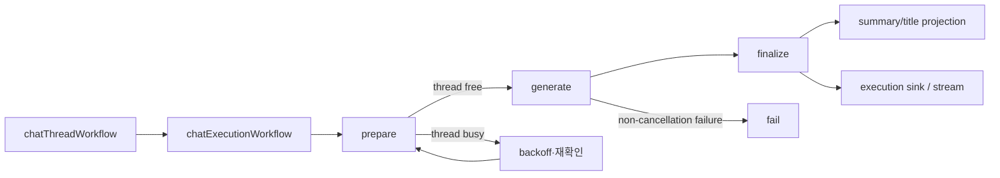
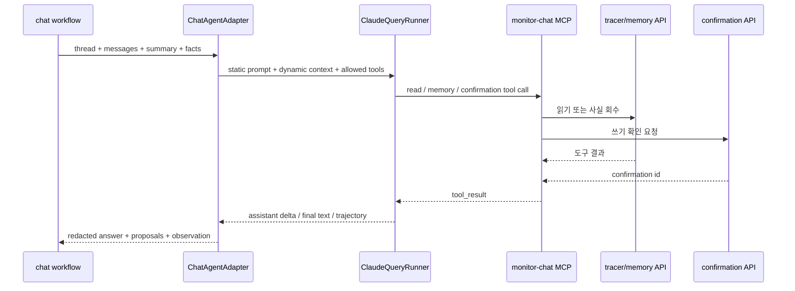
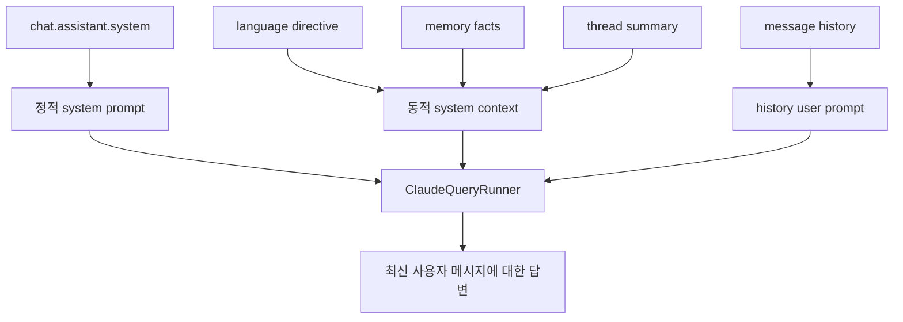
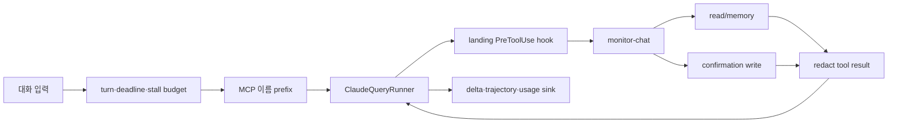
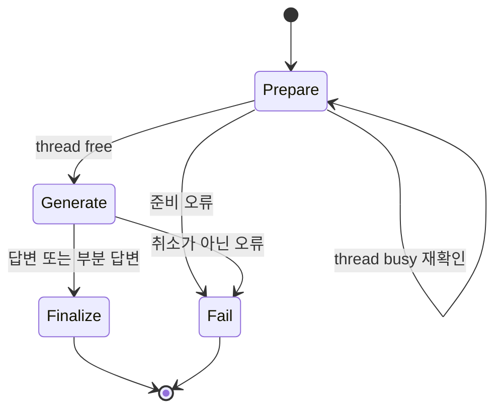

# Chat 에이전트

Chat 에이전트는 대화 스레드의 최신 사용자 메시지를 기준으로 기록 조회·메모리 회수·쓰기 확인 요청을 수행하고, 모델의 자연어 응답을 스트림과 실행 원장으로 남긴다. 자유 텍스트 응답을 사용하므로 recipe·cleanup·title과 달리 최종 응답을 구조화 출력 schema로 강제하지 않는다.

## 구성 요소

| 구성 요소 | 책임 |
| --- | --- |
| `chatThreadWorkflow` | 스레드 수명주기와 실행 큐·projection 경계를 관리한다 |
| `chatExecutionWorkflow` | 준비 → 생성 → 정산·실패 순서를 관리한다 |
| `PrepareChatExecutionUsecase` | 스레드 점유와 실행 입력을 준비한다 |
| `ChatAgentAdapter` | prompt·도구·SDK 호출·응답·proposal을 조정한다 |
| `chat.read.tools.ts` | tracer API의 읽기 도구를 계약 schema로 호출한다 |
| `chat.memory.tools.ts` | memory API의 사실 회수 도구를 제공한다 |
| `chat.write.tools.ts` | 쓰기 동작을 confirmation API에 위임한다 |
| `GetNextChatExecutionUsecase` | 이 스레드에서 이 축이 맡은 다음 대기 실행을 원장에서 조회한다 |
| `ChatExecutionSinkFactoryPort` | 토큰·도구·단계 진행을 스트림으로 전달한다 |

## 토폴로지와 워크플로

Chat의 주요 실행 노드는 `prepare`, `generate`, `finalize`, `fail`이다. 모델 내부에서 도구를 사용하는 흐름은 별도의 graph node가 아니라 하나의 `generate` activity 안에서 Claude Agent SDK가 반복 수행하는 turn이다.



`prepareUntilThreadFrees`는 스레드가 사용 중이면 정해진 횟수와 간격으로 재확인한다. `generate`는 15분 start-to-close, 30초 heartbeat, 설정된 최대 시도 횟수의 재시도 정책을 사용한다. 정산은 취소 중에도 완료되어야 하므로 finalize activity는 non-cancellable 경계로 실행된다.

## 노드와 이동



## 도구 타입

Chat 계약에는 35개 도구가 정의되어 있다. 실행 권한은 도구 surface에 따라 분리한다.

| 타입 | 수량 | 예시 | 실행 경계 |
| --- | ---: | --- | --- |
| 읽기 도구 | 10 | `search_tasks`, `get_task`, `get_timeline`, `get_rule_evidence`, `search_events`, `list_memos`, `list_rules`, `list_tags`, `list_recipes`, `list_cleanup_suggestions` | tracer API |
| Agent read | 1 | `get_job` | agent API 내부 surface |
| memory | 1 | `recall_facts` | memory API |
| 확인 쓰기 | 23 | `remember_fact`, `update_task`, `create_memo`, `create_rule`, `set_task_tags`, `accept_recipe`, `accept_cleanup`, `enqueue_job` | confirmation API |

읽기·memory 도구는 즉시 조회할 수 있다. 쓰기 도구는 직접 mutation을 실행하지 않고 `POST /api/agent/chat/threads/{threadId}/confirmations`를 호출해 사용자의 확인을 기다린다. 확인 식별자는 trajectory와 `ChatTurnToolCall`에 기록된다.

## 프롬프트 구성

`chat.assistant.system` 계약 prompt에 도구 실행 의미, grounding 규칙, memory 규칙, 응답 언어 지시를 slot으로 주입한다. 실행 시 다음의 세 가지 context를 구분한다.



- `renderChatTurnContext`는 언어, memory, summary, facts를 동적 context로 만든다.
- `renderChatPrompt`는 전체 history를 `<history source="untrusted">` 안에 넣고 최신 사용자 메시지에 답하도록 지시한다.
- memory·summary·tool result·사용자 입력은 지시문이 아니라 참고 데이터로 취급한다.
- 답변·초안·도구 결과는 `redactText`를 거친 뒤 sink와 저장소로 전달한다.
- Chat은 자유 텍스트 출력이므로 최종 텍스트 선택과 `chatStopReason` 계산이 도메인 후처리에 포함된다.

`buildChatSystemPrompt`가 조립하는 정적 접두부이며 `<<슬롯>>` 자리에 계약 조각이 들어간다. 맨 앞의 `SAFETY_POLICY`는 상위 문서가 갖는다.

슬롯의 본문은 계약이 소유하며 Python 구현이 읽는 것과 같은 template 이다.

```
chat.assistant.system
```

프롬프트 전문은 문서가 옮겨 적지 않는다. 슬롯의 본문은 계약이, 슬롯을 감싸는 scaffold 는
`model/chat.prompt.ts` 가 소유하며 `buildChatSystemPrompt` 가 둘을 조립한다.
두 축이 같은 template 을 읽으므로 그 본문을 문서 두 벌로 두면 계약이 바뀔 때 함께 낡는다.

```
계약   contract/agent/chat/prompt.json
chat.assistant.system
```

## 미들웨어와 출력 타입

Chat에 적용되는 횡단 정책은 공통 `ClaudeQueryRunner`에 의해 제공된다. `allowedTools`는 `monitor-chat` server의 허용 도구만 포함하며, MCP prefix는 모델 호출 시에만 적용한다. stream sink는 assistant delta, tool call, tool result, usage를 관측하고 사용자 스트림에 전달한다.



## Temporal 워크플로

`chat.thread.workflow.ts`가 스레드 하나를 소유하고 `chat.execution.workflow.ts`가 턴 하나를
소유한다. 스레드 워크플로는 접수 신호를 받으면 원장에서 다음 대기 실행을 조회해 자식 워크플로로
띄운다. 시그널은 대기 줄이 움직였다는 포인터이고 실행의 사실은 원장이 갖는다.

| 액티비티 | start-to-close | 재시도 | 비고 |
| --- | --- | ---: | --- |
| `prepareChatExecution` | 2분 | 5 | 스레드가 잠겨 있으면 정해진 회차만큼 다시 확인한다 |
| `generateChatExecution` | 15분 | `CHAT_GENERATE_MAX_ATTEMPTS` | 30초 heartbeat. 취소는 `WAIT_CANCELLATION_COMPLETED`로 최종 상태를 기다린다 |
| `finalizeChatExecution` | 2분 | 5 | 취소 중에도 완료되어야 사용자가 본 답변이 원장에 남는다 |
| `failChatExecution` | 1분 | 5 | 실패 사유를 원장에 남긴다 |
| `getNextChatExecution` | 1분 | 5 | 이 스레드에서 이 축이 맡은 다음 대기 실행을 조회한다 |



생성 액티비티는 `generate` 큐가 아니라 `chat` 큐에서 실행된다. 대화는 사용자가 기다리는
경로라 잡의 긴 생성과 큐를 나누지 않는다.

## 관련 코드

- `model/chat.spec.ts`: 도구 목록, 실패 계약, 모델·turn·출력·deadline 제한
- `model/chat.prompt.ts`: system/context/history/summary/title prompt 조립
- `adapter/chat.agent.adapter.ts`: SDK 실행과 응답·proposal 조정
- `adapter/chat.read.tools.ts`: 읽기 도구 adapter
- `adapter/chat.memory.tools.ts`: memory 도구 adapter
- `adapter/chat.write.tools.ts`: confirmation write adapter
- `inbound/chat.thread.workflow.ts`, `inbound/chat.execution.workflow.ts`: Temporal workflow
