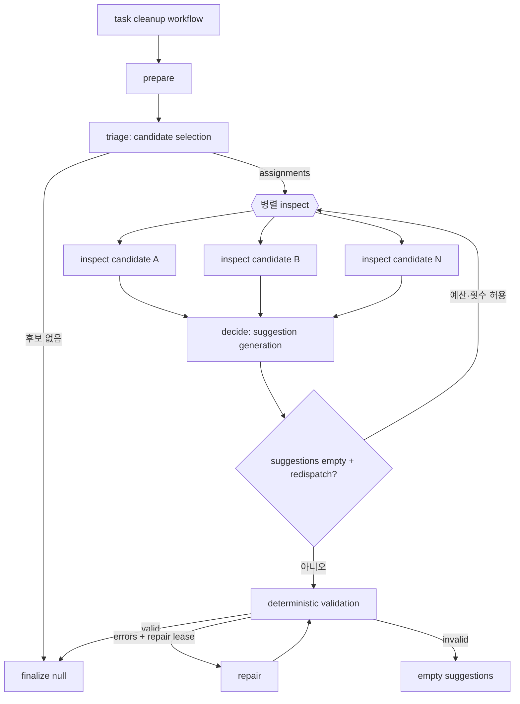
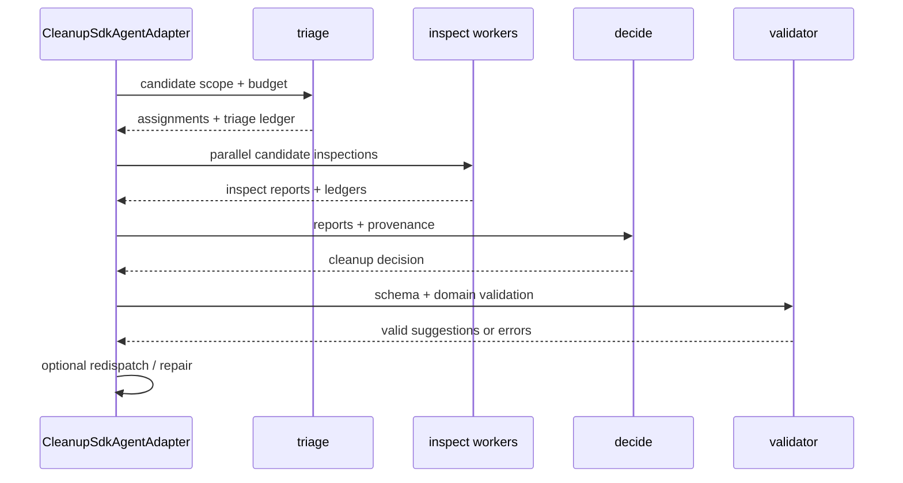
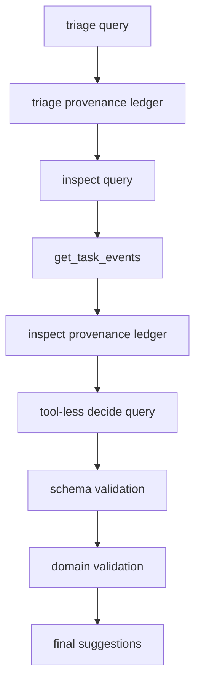
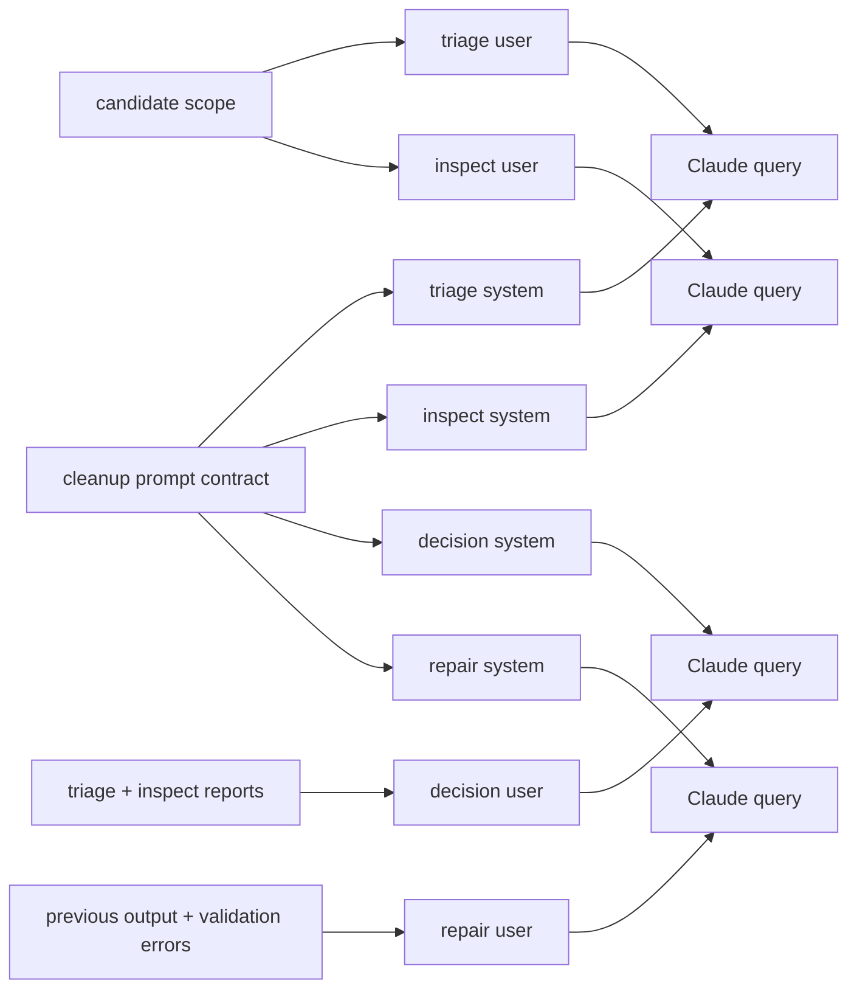
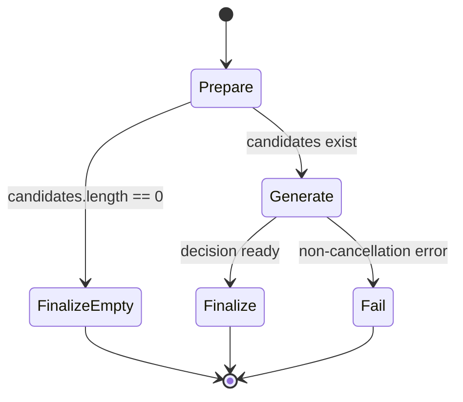

# Cleanup 에이전트

Cleanup 에이전트는 정리 후보 task를 선별하고, 이벤트를 검사해 보관·정리 제안을 생성한다. 후보를 직접 삭제하지 않으며, 결과는 제안 목록으로 반환되어 별도 확인·정책 경계를 따른다.

## 토폴로지와 워크플로

주요 실행 단계는 `triage`, `inspect`, `decide`, `repair`이다. triage가 후보를 좁히고, inspect가 후보별 이벤트를 확인하며, decide가 정리 제안을 구조화한다.



후보가 없으면 generate activity 자체를 호출하지 않고 finalize로 이동한다. 후보가 있으면 triage·inspect·decide는 generate worker에서 실행되며, 각 단계는 제한된 turn budget과 provenance ledger를 사용한다.

## 노드와 이동

| 단계 | 입력 | 도구 | 출력 |
| --- | --- | --- | --- |
| `triage` | 요청이 실어 준 후보 배치, 최대 제안 수 | 없음 | 후보와 depth를 담은 inspect assignment와 후보 ledger |
| `inspect` | 후보 task ID, 보관 기준 | `get_task_events` | `InspectReport`와 후보별 ledger |
| `decide` | triage·inspect 보고서, 언어, 제안 제한 | 없음 (`CLEANUP_COORDINATOR_TOOLS = []`) | `CleanupDecision` |
| `repair` | 직전 결정, 검증 오류 | 없음 | 재검증 가능한 제안 목록 |



## 도구 타입

Cleanup MCP server 이름은 `monitor-task-cleanup`이다. triage는 도구를 갖지 않고 요청이 실어 준 후보 배치만 보며, inspect는 `get_task_events`만 사용한다. decide는 도구를 사용하지 않으므로 `cleanup.sdk.query.ts`는 해당 호출에서 `mcpServers`를 생략한다.

| 정책 | 적용 내용 |
| --- | --- |
| tool allowlist | triage와 inspect 단계별로 단일 도구만 허용한다 |
| provenance | 후보와 이벤트의 출처를 ledger에 누적한다 |
| redaction | 도구 결과와 최종 제안에서 민감 정보를 제거한다 |
| budget lease | repair와 triage와 decision 몫을 조사 전에 예약하며 비율은 계약의 `reservation`이 갖는다 |
| redispatch | 제안이 없고 재조사 요청이 있으며 남은 예산이 있을 때만 수행한다 |
| structured validation | schema 검증 후 도메인 검증을 추가로 수행한다 |



## 프롬프트 구성

계약 prompt는 cleanup investigator와 repair, triage, inspect 역할을 분리한다. system prompt는 정리 기준과 검토 보장과 evidence discipline을 제공하고, user prompt는 후보와 이벤트와 제안 한도와 출력 언어 지시를 전달한다. 언어가 사용자 prompt에 있으므로 system prompt는 호출마다 같은 글이고 그 접두사가 캐시에 남는다.



모델 출력은 `TriagePlan`, `InspectReport`, `CleanupDecision` schema로 파싱한다. 이후 `filterValidCleanupSuggestions`가 도메인 제약을 본다. 겹친 제안과 상한을 넘은 꼬리는 다시 물어도 같은 답이 오므로 사유 없이 지우고, 근거가 어긋난 제안만 모델이 고칠 사유로 남긴다. repair 후에도 오류가 남으면 유효한 제안만 반환하거나 빈 목록으로 종료한다.

`buildCleanupSystemPrompt`가 조립하는 coordinator 의 system prompt 다. triage 와 inspect 는 각자 template 을 갖는다.

슬롯의 본문은 계약이 소유하며 Python 구현이 읽는 것과 같은 template 이다.

```
task-cleanup.investigator.system
task-cleanup.investigator.repair
task-cleanup.triage.system
task-cleanup.inspect.system
```

프롬프트 전문은 문서가 옮겨 적지 않는다. 슬롯의 본문은 계약이, 슬롯을 감싸는 scaffold 는
`model/cleanup.prompt.ts` 가 소유하며 `buildCleanupSystemPrompt` 가 둘을 조립한다.
두 축이 같은 template 을 읽으므로 그 본문을 문서 두 벌로 두면 계약이 바뀔 때 함께 낡는다.

```
계약   contract/agent/task-cleanup/prompt.json
task-cleanup.investigator.system
task-cleanup.investigator.repair
task-cleanup.triage.system
task-cleanup.inspect.system
```

## 미들웨어와 출력 타입

Cleanup에 적용되는 횡단 정책은 공통 `ClaudeQueryRunner`가 제공한다. 단계마다 허용 도구를
좁히고, deadline과 landing hook과 trajectory 수집과 redaction과 fallback model을 같은
경로에서 적용한다.

| 정책 | 적용 내용 |
| --- | --- |
| tool allowlist | triage와 inspect는 단일 도구만, decide는 도구 없이 실행한다 |
| provenance | 후보와 이벤트의 출처를 단계별 ledger에 누적한다 |
| redaction | 도구 결과와 최종 제안에서 민감 정보를 제거한다 |
| budget lease | repair와 triage와 decision 몫을 조사 전에 예약한다 |
| redispatch | 제안이 없고 재조사 요청이 있으며 남은 예산이 있을 때만 수행한다 |
| structured validation | zod schema 검증 뒤 도메인 검증을 한 번 더 수행한다 |

출력 타입은 `TriagePlan` → `InspectReport` → `CleanupDecision` 순서로 좁혀지고, 최종
`CleanupDecision`이 검증을 통과해야 제안 목록이 된다. 검증이 소진되면 후보를 바꾸지 않고
빈 제안으로 종료한다.

## Temporal 워크플로

`cleanup.workflow.ts`는 prepare → generate → finalize/fail 순서를 사용한다. prepare 결과의 후보 배열이 비어 있으면 generate를 생략하고 null 산출물로 finalize한다. generate activity는 10분 start-to-close, 30분 schedule-to-close, 30초 heartbeat와 최대 3회 재시도를 사용한다.



## 관련 코드

- `adapter/cleanup.sdk.agent.adapter.ts`: 단계 조정·budget·redispatch·repair
- `adapter/cleanup.sdk.orchestration.ts`: triage·inspect·decision phase
- `adapter/cleanup.sdk.query.ts`: 단계별 query와 MCP server 선택
- `adapter/cleanup.tools.ts`: 후보·이벤트 도구와 provenance
- `model/cleanup.prompt.ts`: 단계별 prompt 조립
- `model/cleanup.dispatch.policy.ts`: inspect dispatch 정책
- `adapter/cleanup.output.adapter.ts`: 제안의 원장 적재와 output 단계 가림
- `adapter/cleanup.observed.activity.adapter.ts`: 수용이 조건으로 실을 마지막 사건 시각 읽기
- `inbound/cleanup.workflow.ts`: Temporal workflow
