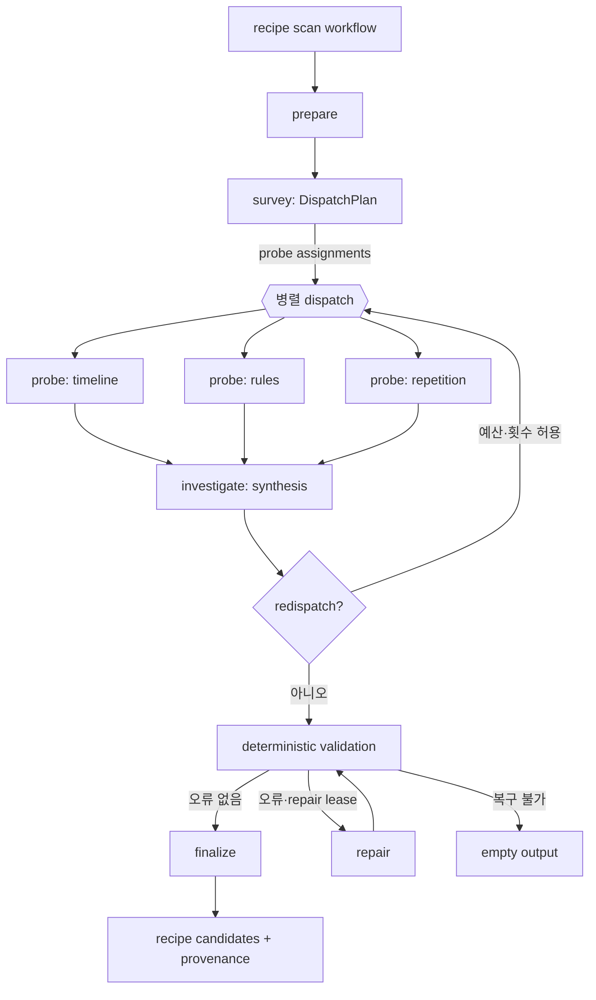
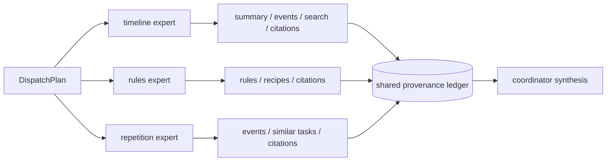
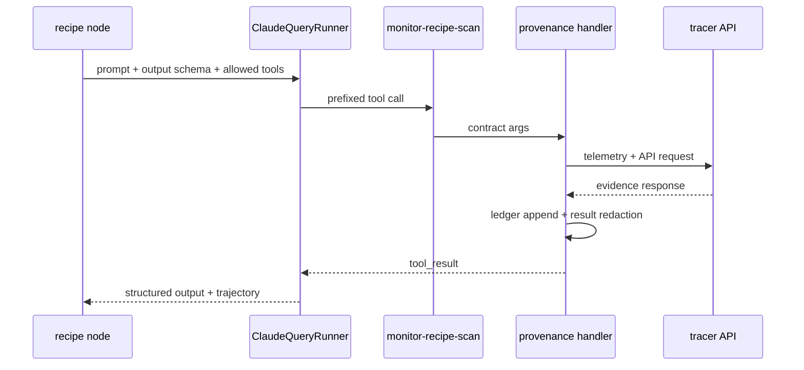
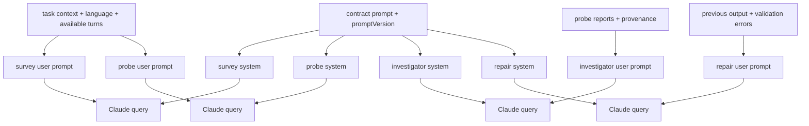
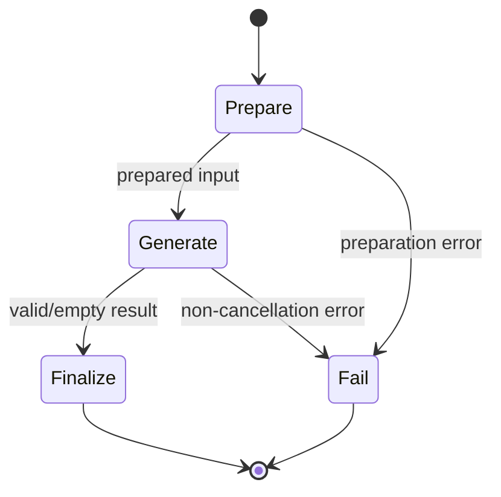

# Recipe 에이전트

Recipe 에이전트는 작업의 이벤트와 규칙과 유사 recipe를 조사해 recipe 후보를 제안한다. 여러 전문 조사 단계를 병렬 실행하고, coordinator가 provenance를 확인한 뒤 후보를 생성한다. 후보가 검증에 실패하면 제한된 repair를 수행하며, 조사 범위가 부족하면 redispatch로 probe를 추가한다.

## 토폴로지와 워크플로

주요 실행 단계는 `survey`, `probe`, `investigate`, `repair`이다. `survey`가 전문가별 probe 계획을 만들고, `probe`가 전문 역할별 증거를 모으며, `investigate`가 후보를 합성한다.



`runRecipeSurveyPhase`, `dispatchRecipeProbes`, `synthesizeRecipe`가 단계 조정을 담당한다. probe는 `Promise.all`로 병렬 실행하지만 각 probe는 계획이 고른 depth의 몫만큼 lease를 받으며, 전체 실행 예산을 초과하지 않는다.

## 노드와 이동

| 단계 | 입력 | 도구 | 출력과 다음 이동 |
| --- | --- | --- | --- |
| `survey` | 작업 요약, 목표, 언어, 남은 turn | 없음 | 전문가와 depth를 담은 `DispatchPlan`; probe가 없으면 빈 결과 |
| `probe` | 전문 역할, 작업 ID, 조사 지시 | `get_task_summary`, `get_task_events`, `list_rules`, `search_events`, `find_similar_tasks`, `search_recipes` 중 일부 | `ProbeReport`와 provenance ledger |
| `investigate` | probe report, 공유 ledger, 후보 예산 | 없음 | `RecipeSynthesis`; 필요하면 `redispatch` |
| `repair` | 직전 출력, 검증 오류, 언어 | 없음 또는 단계별 제한 도구 | 재검증 가능한 `RecipeSynthesis` |

coordinator는 도구를 갖지 않고 인용 가능한 식별자를 요청으로 받는다. 조사 도구의 실제 호출은 MCP handler가 수행하고, provenance ledger가 출처와 관측 범위를 누적한다.

## 전문 dispatch 정책



- timeline 역할은 시간 흐름과 반복 패턴에 필요한 task summary·events·search를 조사한다.
- rules 역할은 rule과 recipe 맥락을 조사하고 적용 가능한 근거를 찾는다.
- repetition 역할은 유사 task와 반복 이벤트를 조사한다.
- coordinator는 인용 완전성을 검사하고 provenance와 연결된 후보만 합성한다.

## 도구 타입

도메인 MCP server 이름은 `monitor-recipe-scan`이다. `recipe.sdk.query.ts`가 단계별 allowed tools와 MCP server와 모델 옵션을 조합하고, `ClaudeQueryRunner`가 deadline·landing hook·trajectory·redaction·fallback model을 적용한다.



주요 도구 타입은 다음과 같다.

| 도구 | 목적 |
| --- | --- |
| `get_task_summary` | 작업의 현재 요약 조회 |
| `get_task_events` | 작업 이벤트와 turn 조회 |
| `list_rules` | 적용 가능한 규칙 조회 |
| `search_events` | 조건에 맞는 사건 검색 |
| `find_similar_tasks` | 유사 작업 검색 |
| `search_recipes` | 등록된 recipe 맥락 검색 |

도구 결과가 노출한 데이터는 provenance ledger에 기록되며, 민감 정보 redaction 이후 모델에 전달된다. 도구 오류는 probe 단계에서 실패 보고서로 낮춰질 수 있으나, 최종 후보는 검증 규칙을 통과해야 한다.

## 프롬프트 구성

계약 prompt는 `recipe-scan.survey.system`, `recipe-scan.probe.system`, `recipe-scan.investigator.system`, `recipe-scan.investigator.repair`로 분리된다.



각 prompt는 증거 출처, 인용 규율, 후보 예산, 재분배 프로토콜, 출력 필드를 slot으로 주입한다. 출력은 `DispatchPlan`, `ProbeReport`, `RecipeSynthesis` schema로 검증하고, 마지막에는 `validateRecipeCandidates`가 도메인 규칙을 다시 검사한다.

`buildRecipeSystemPrompt`가 조립하는 coordinator 의 system prompt 다. survey 와 probe 는 각자 template 을 갖는다.

슬롯의 본문은 계약이 소유하며 Python 구현이 읽는 것과 같은 template 이다.

```
recipe-scan.investigator.system
recipe-scan.investigator.repair
recipe-scan.survey.system
recipe-scan.probe.system
```

프롬프트 전문은 문서가 옮겨 적지 않는다. 슬롯의 본문은 계약이, 슬롯을 감싸는 scaffold 는
`model/recipe.prompt.ts` 가 소유하며 `buildRecipeSystemPrompt` 가 둘을 조립한다.
두 축이 같은 template 을 읽으므로 그 본문을 문서 두 벌로 두면 계약이 바뀔 때 함께 낡는다.

```
계약   contract/agent/recipe-scan/prompt.json
recipe-scan.investigator.system
recipe-scan.investigator.repair
recipe-scan.survey.system
recipe-scan.probe.system
```

## 미들웨어와 출력 타입

Recipe에 적용되는 횡단 정책은 공통 `ClaudeQueryRunner`가 제공한다. `recipe.sdk.query.ts`가
단계별 허용 도구와 MCP server와 모델 옵션을 조합하고, 실행기가 deadline과 landing hook과
trajectory 수집과 redaction과 fallback model을 적용한다.

| 정책 | 적용 내용 |
| --- | --- |
| tool allowlist | probe는 역할별 도구를, coordinator는 `RECIPE_COORDINATOR_TOOLS`만 허용한다 |
| provenance | probe가 본 것을 공유 ledger에 누적하고 coordinator가 그것만 인용한다 |
| redaction | 도구 결과와 최종 후보에서 민감 정보를 제거한다 |
| budget lease | probe마다 가중 lease를 받고 전체 실행 예산을 넘지 않는다 |
| redispatch | 조사 범위가 부족하고 예산과 횟수가 남았을 때만 probe를 추가한다 |
| structured validation | zod schema 검증 뒤 `validateRecipeCandidates`가 도메인 규칙을 확인한다 |

출력 타입은 `DispatchPlan` → `ProbeReport` → `RecipeSynthesis` 순서로 좁혀진다. 최종
`RecipeSynthesis`가 검증을 통과해야 recipe 후보와 provenance가 된다.

## Temporal 워크플로

`recipe.workflow.ts`는 prepare → generate → finalize 순서를 사용한다. generate activity는 `generate` task queue에서 15분 start-to-close, 1시간 schedule-to-close, 30초 heartbeat와 최대 3회 재시도를 적용한다. prepare·finalize·fail은 짧은 activity retry 정책을 사용한다.



## 관련 코드

- `adapter/recipe.agent.adapter.ts`: 전체 단계 조정·budget·repair·output 구성
- `adapter/recipe.sdk.orchestration.ts`: survey·probe·synthesis phase
- `adapter/recipe.sdk.query.ts`: Claude SDK query spec과 MCP 연결
- `adapter/recipe.tools.ts`: 계약 도구와 provenance handler
- `model/recipe.dispatch.policy.ts`: 전문 역할별 도구 선택
- `model/recipe.prompt.ts`: 단계별 prompt 조립
- `inbound/recipe.workflow.ts`: Temporal workflow
