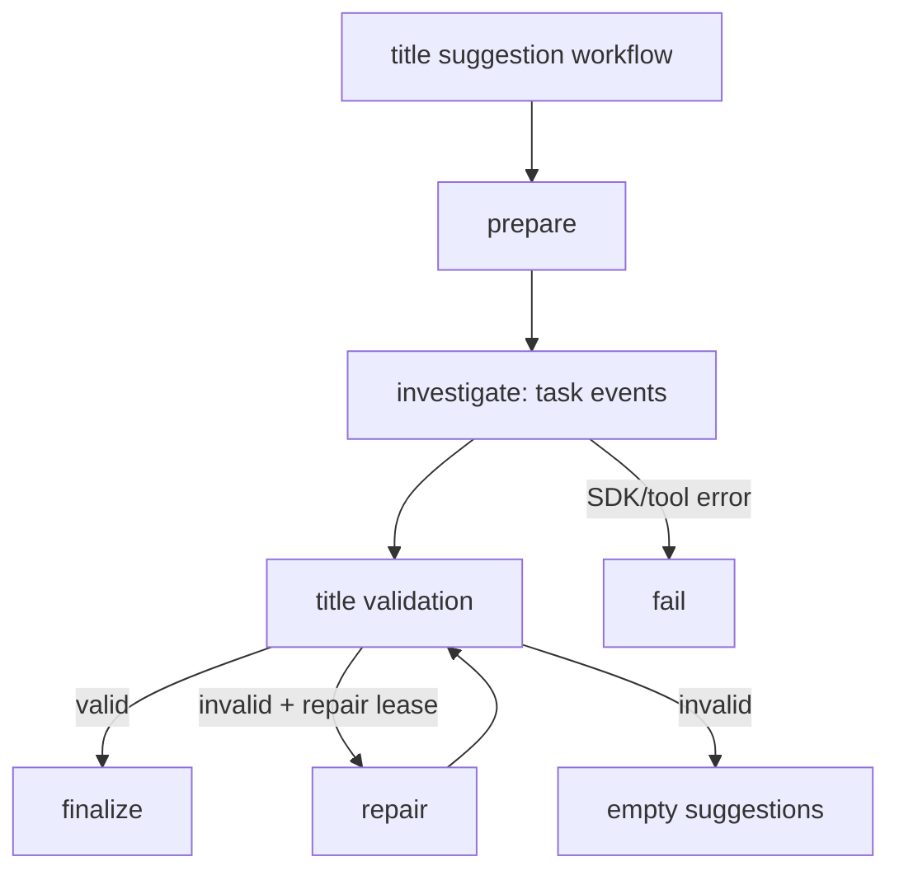
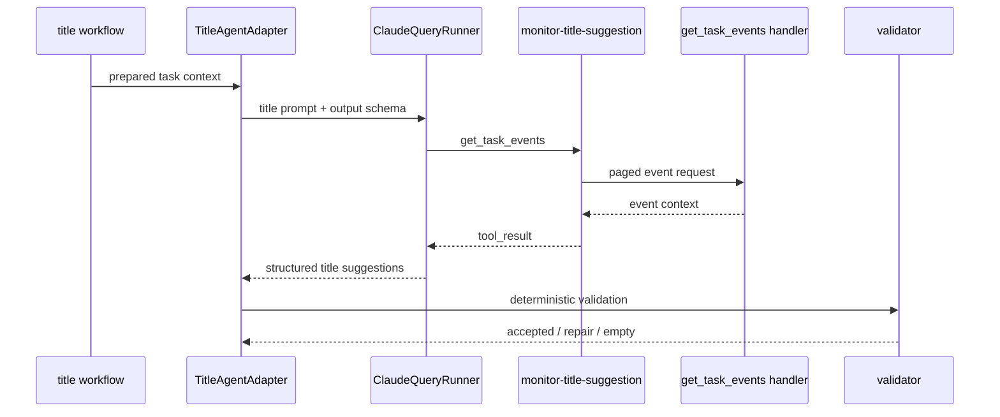
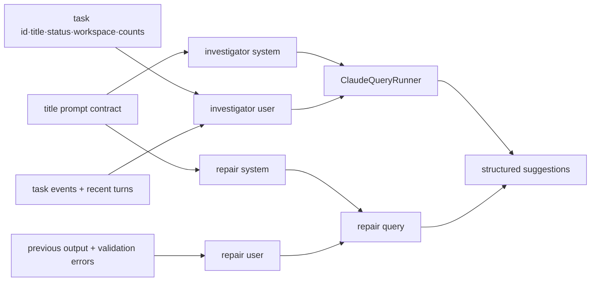
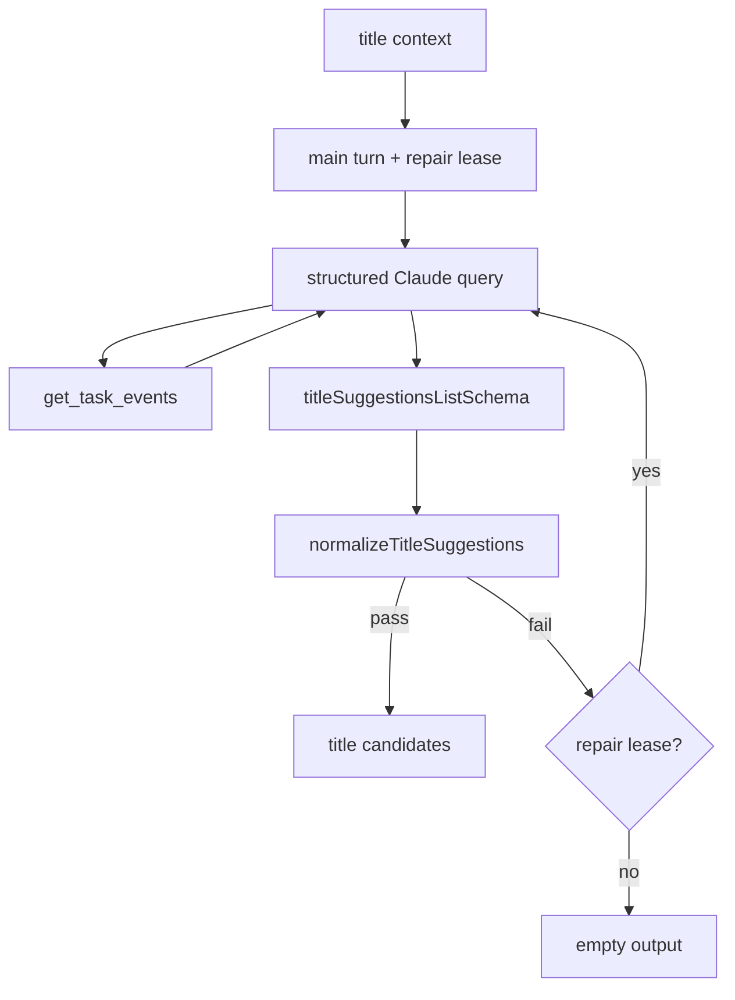
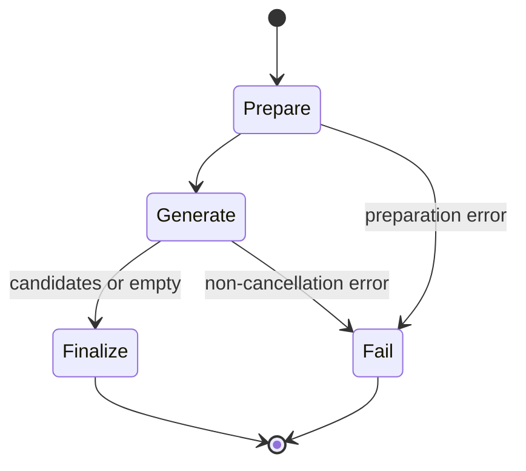

# Title 에이전트

Title 에이전트는 task의 현재 제목과 상태와 이벤트 맥락을 조사해 2~3개의 제목 후보를 제안한다. 제안은 구조화 출력과 결정적 검증을 통과해야 반환되며, task를 직접 변경하지 않는다.

## 토폴로지와 워크플로

주요 실행 단계는 `investigate`와 `repair`이다. recipe·cleanup처럼 multi-agent dispatch를 사용하지 않고, 하나의 조사 도구와 하나의 구조화 출력 호출을 예산 안에서 실행한다.



`TitleAgentAdapter`는 첫 investigate에 1 turn을 배정하고 repair lease를 별도로 예약한다. 현재 제목이 이미 적절한 경우 prompt가 빈 제안을 허용하며, 검증 실패 시 repair를 한 번 실행할 수 있다.

## 노드와 이동

| 단계 | 입력 | 도구 | 출력 |
| --- | --- | --- | --- |
| `investigate` | task ID, 현재 제목, 상태, workspace, activity count, 최근 turn | `get_task_events` | `titleSuggestionsListSchema` 구조화 결과 |
| `repair` | 직전 출력, 검증 오류, 언어 | `get_task_events`를 포함한 query 경계 | 재검증 가능한 제목 후보 |
| `validate` | 모델 출력 | 없음 | 유효 제목 또는 빈 결과 |



## 도구 타입

Title MCP server 이름은 `monitor-title-suggestion`이다. `get_task_events`는 `taskId`, `limit`, `cursor`, `order`를 계약 schema로 검증하고, 이벤트를 페이지 단위로 반환한다. handler는 호출 telemetry를 남기며 모델에 필요한 범위만 직렬화한다.

## 프롬프트 구성

계약 prompt는 `title-suggestion.investigator.system`과 `title-suggestion.investigator.repair`로 구성된다. system prompt는 task context의 의미, 근거 pull 방식, 제목 specification, 응답 형식을 slot으로 제공한다.



사용자 prompt에는 현재 제목, 상태, 작업 공간, 활동 개수, 최근 사용자·어시스턴트 turn과 출력 언어 지시를 넣고, 긴 turn은 정해진 길이로 절단한다. 언어가 사용자 prompt에 있으므로 system prompt는 호출마다 같은 글이고 그 접두사가 캐시에 남는다. 결과는 언어 요구와 제목 중복·길이·형식 규칙을 함께 만족해야 한다.

`buildTitleSystemPrompt`가 조립하는 system prompt 다. `PULL_MORE_EVIDENCE`는 근거가 부족할 때 도구를 더 부르라는 코드 소유 지시문이다.

슬롯의 본문은 계약이 소유하며 Python 구현이 읽는 것과 같은 template 이다.

```
title-suggestion.investigator.system
title-suggestion.investigator.repair
```

프롬프트 전문은 문서가 옮겨 적지 않는다. 슬롯의 본문은 계약이, 슬롯을 감싸는 scaffold 는
`model/title.prompt.ts` 가 소유하며 `buildTitleSystemPrompt` 가 둘을 조립한다.
두 축이 같은 template 을 읽으므로 그 본문을 문서 두 벌로 두면 계약이 바뀔 때 함께 낡는다.

```
계약   contract/agent/title-suggestion/prompt.json
title-suggestion.investigator.system
title-suggestion.investigator.repair
```

## 미들웨어와 출력 타입

Title query는 `allowedTools`에 `get_task_events`만 넣고, `ClaudeQueryRunner`의 공통 deadline·landing hook·redaction·trajectory 수집을 적용한다. `runStructuredQuery`가 JSON과 zod schema를 검증한 후 `normalizeTitleSuggestions`가 되풀이와 중복과 자리표시자 후보를 지우고 남은 수가 모자랄 때만 사유를 낸다. 그 사유가 repair lease를 소진하면 task를 변경하지 않고 빈 결과를 반환한다.



## Temporal 워크플로

`title.workflow.ts`는 prepare → generate → finalize/fail 순서를 사용한다. generate activity는 5분 start-to-close, 20분 schedule-to-close, 30초 heartbeat와 최대 3회 재시도를 적용한다.



## 관련 코드

- `adapter/title.agent.adapter.ts`: prompt·도구·예산·repair·output 조정
- `adapter/title.tools.ts`: `get_task_events` handler
- `model/title.prompt.ts`: system·user·repair prompt 조립
- `model/title.suggestion.schema.ts`: 구조화 출력 schema
- `model/title.validation.model.ts`: 결정적 검증
- `inbound/title.workflow.ts`: Temporal workflow
